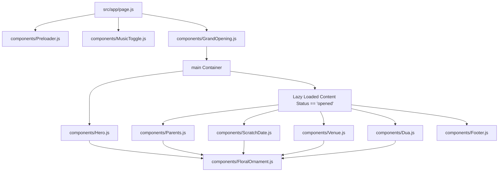

# Project Architecture and Component Hierarchy

This document outlines the codebase directories, structural components, and how components are organized. It also details the application lifecycle state machine.

---

## 1. Project Directory Structure

Below is the file directory of the template project. Highlighted items represent files that directly configure core layouts or state variables.

```
fauzanhuda/
├── docs/                      # Framework Handover Documentation
│   ├── README.md
│   ├── architecture.md
│   ├── design_and_animation.md
│   ├── framework_guide.md
│   └── operations_and_perf.md
├── public/                    # Static Assets (Images, Icons, Audio)
│   └── audio/
│       └── background_music.mp3
├── src/
│   ├── app/
│   │   ├── globals.css        # Tailwind v4 Theme Tokens & keyframe rules
│   │   ├── layout.js          # Core HTML head metadata config
│   │   └── page.js            # Entry controller & screen state machine
│   ├── components/            # Reusable UI Blocks & Sections
│   │   ├── Dua.js             # RSVP/Dua section
│   │   ├── FloralOrnament.js  # Reusable corner & border styling graphics
│   │   ├── Footer.js          # Social shares & links
│   │   ├── GrandOpening.js    # Envelope split entrance page
│   │   ├── Hero.js            # Landing card with mouse spring parallax
│   │   ├── MusicToggle.js     # Global floating audio visualizer
│   │   ├── Parents.js         # Parents/family details card
│   │   ├── Preloader.js       # Cinematic progress bar preloader
│   │   ├── ScratchDate.js     # Countdown scratch date card
│   │   └── Venue.js           # Google Maps card & directions button
│   └── utils/
│       └── audioSynth.js      # Web Audio synthesizers (tap clicks, hinge creaks)
├── next.config.mjs            # Next.js configurations
└── package.json               # Dependecy specs
```

---

## 2. Component Hierarchy

The page acts as the root orchestrator. The tree below details how components are nested and initialized.



---

## 3. Screen Lifecycle and State Machine

The entire invitation experience is governed by a state transition machine declared in [src/app/page.js](file:///c:/The%20Og%20Folder/fauzanhuda/src/app/page.js) using the `status` hook.

```
       +-----------------------+
       |       "loading"       |  (Preloader.js is active)
       +-----------------------+
                   | (Progress bar completes after 3.2s)
                   v
       +-----------------------+
       |      "entrance"       |  (GrandOpening.js closed-door is shown)
       +-----------------------+  (Hero.js is mounted underneath)
                   | (User clicks 'Tap to Open')
                   v
       +-----------------------+
       |    "transitioning"    |  (GSAP timeline plays fade transitions)
       +-----------------------+
                   | (GSAP animation onComplete triggers)
                   v
       +-----------------------+
       |       "opened"        |  (Lenis smooth scroll is mounted)
       +-----------------------+  (Parents, ScratchDate, Venue, etc., load)
```

### State-to-UI Sync Details
1. **`loading`**:
   - The body is locked to prevent scrolls.
   - `Preloader.js` displays a stylized loading bar.
2. **`entrance`**:
   - `Preloader` is unmounted.
   - `page.js` switches body background to `#1A0208` (rich burgundy) to prevent flashes of white.
   - `<Hero />` is pre-mounted underneath `GrandOpening` so that Next.js handles compilation, rendering, and hydration while the user looks at the closed doors.
3. **`transitioning`**:
   - Audio clicks and wind hum fade out, and background music starts.
   - On mobile, `GrandOpening` fades out cleanly in `0.5s` via a 2D opacity transition.
   - On desktop, `GrandOpening` plays a detailed 3D envelope flap-unfolding sequence.
4. **`opened`**:
   - `GrandOpening` is unmounted.
   - Heavy components below the fold (`Parents`, `ScratchDate`, etc.) are mounted.
   - Lenis smooth scroll engine is initialized.
   - The page background switches to `bg-brand-bg` (cream) for subsequent sections.

---

## 4. Responsive Design Strategy

The framework applies a rigid, device-specific layout strategy to maximize aesthetics on desktop monitors, laptops, and mobile screens:

* **Mobile (Width < 768px)**:
  - Envelope and Hero elements scale with the viewport using `vw`/`vh` sizing (e.g., `w-[80vw] h-[64svh]`).
  - CPU-heavy operations (e.g. 3D card tilts, complex GSAP timelines, blur/backdrop filters) are disabled.
  - Hover triggers are completely disabled; elements respond cleanly to instant touch interactions.
* **Desktop (Width >= 768px)**:
  - Elements adopt fixed maximum widths (e.g., `md:max-w-[365px]`) to maintain realistic, physical card proportions, avoiding over-stretching on wide monitors.
  - Parallax calculations, 3D rotations, and hover spring animations are fully enabled.
  - Scroll engines apply deceleration springs to mimic luxury inertial scrolling.
